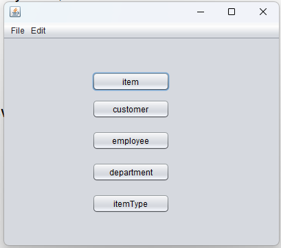
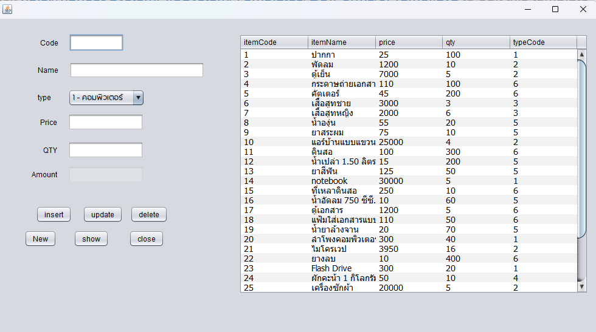
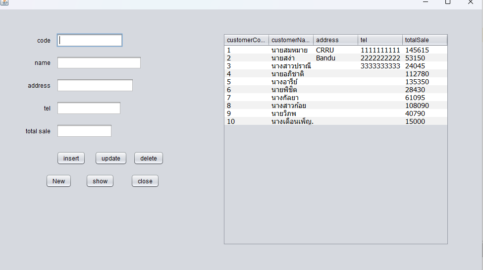
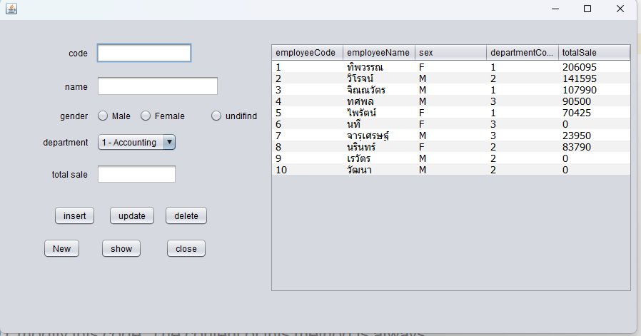
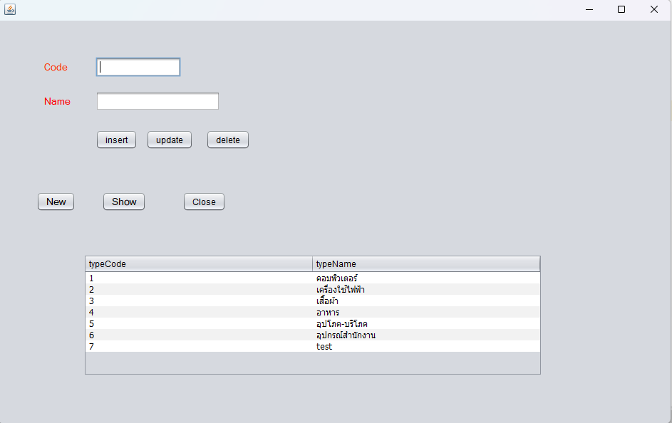

# Java# Store System
* Natdanai Wongsa

### <ins> Main </ins> 

### <ins> Item </ins> 

### <ins> customer </ins> 

### <ins> employee </ins> 

### <ins> department </ins> 

### <ins> ItemType </ins> 

